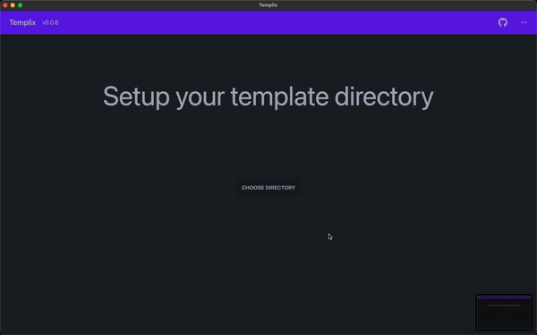
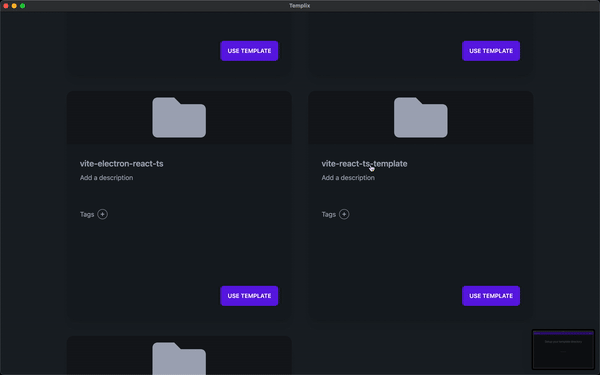
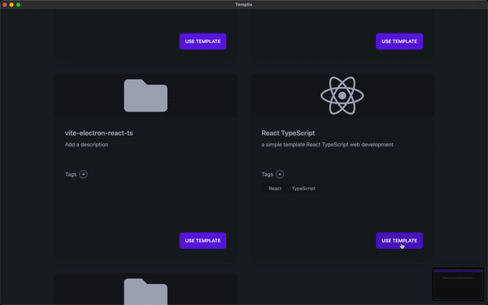

<div style="">
<h1>Templix</h1>

</div>

A project template management GUI tool for developers, made with React + Electron.

## Step 1: Tell Templix where your template directory is located



## Step 2: Customize Templates with custom titles, descriptions, and tags



## Step 3: Use a template by telling Templix where you would like to copy over the directory, then open with your favorite text-editor or terminal emulator



## Recommended IDE Setup

- [VSCode](https://code.visualstudio.com/) + [ESLint](https://marketplace.visualstudio.com/items?itemName=dbaeumer.vscode-eslint) + [Prettier](https://marketplace.visualstudio.com/items?itemName=esbenp.prettier-vscode)

## Project Setup

### Install

```bash
$ npm install
```

### Development

```bash
$ npm run dev
```

### Build

```bash
# For windows
$ npm run build:win

# For macOS
$ npm run build:mac

# For Linux
$ npm run build:linux
```
